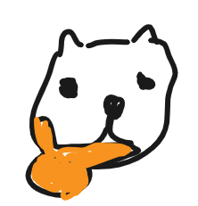

# Team Nyang's

## About

Team Nyang's is a loosely organized group of internet developers who somehow ended up building things together.  
Originally united by a shared appreciation for cats, we now occasionally gather to write code, experiment with ideas, and show up in programming contests or random projects on the internet.

We are not a corporation, a startup, or a very serious organization.
Just developers who like making interesting things — preferably with a cat nearby.

## Members

- Andrew (A.k.a hexagon) : Competive Programming lover (idiot)
- Meta : LuaU's lover.
- Yangpa : 🧅

## Technologies & Languages

- C++
- Python
- Rust
- JS/TS
- Java
- C#, F#
- Dart, Svelte

## Philosophy

- If it compiles, ship it.
- If it doesn't compile, blame the cat.
